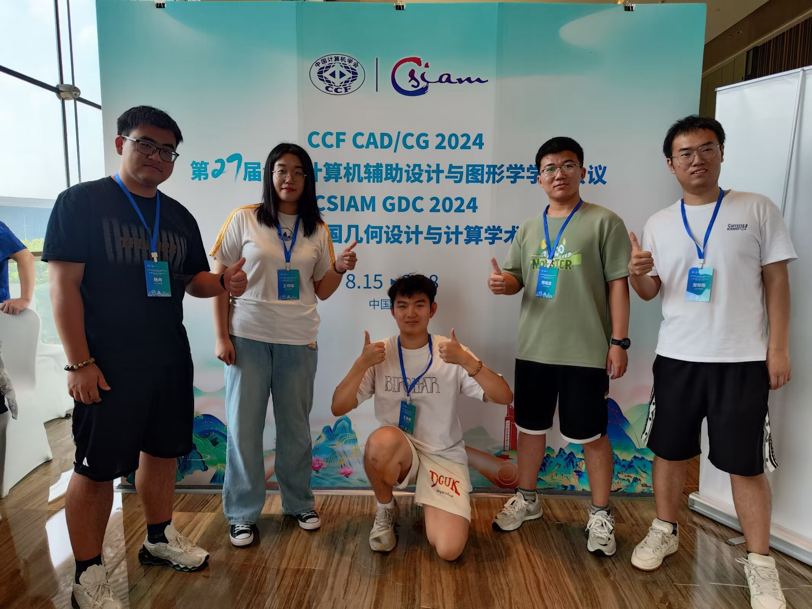
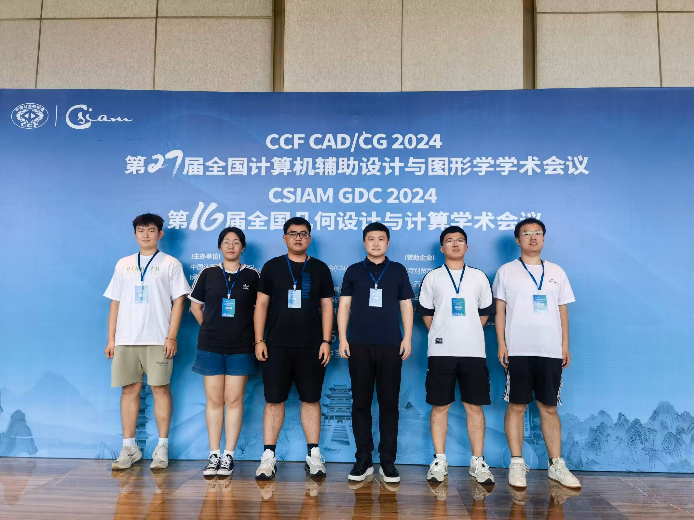
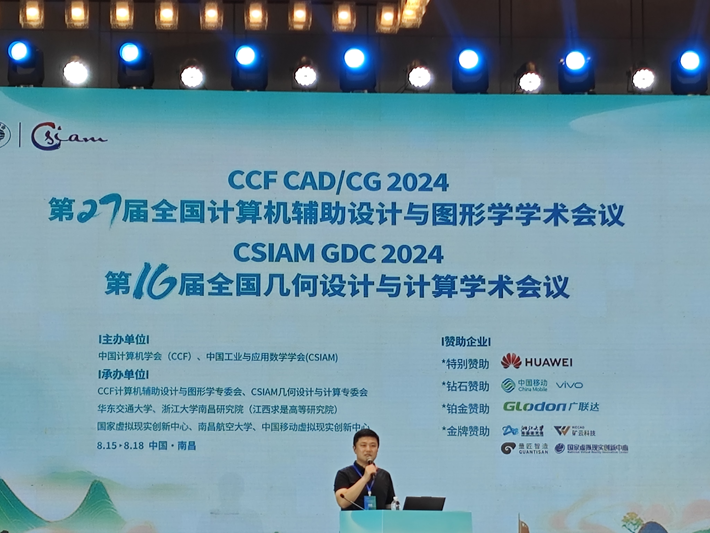
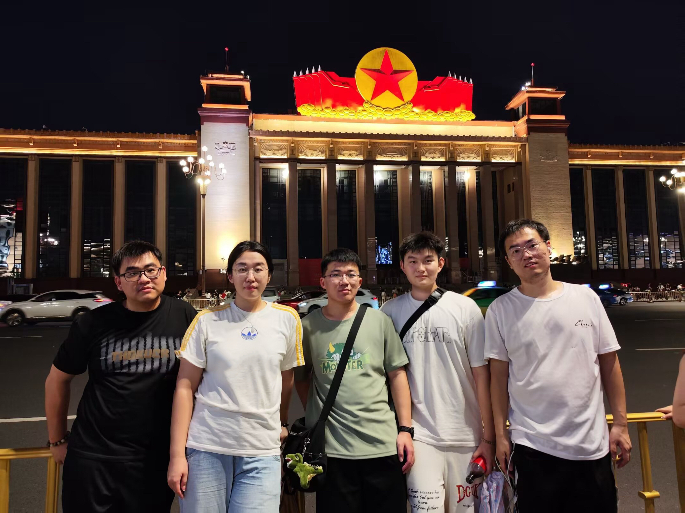

**参会记录**

江西 · 南昌

全国几何设计与计算学术会议由中国工业与应用数学学会几何设计与计算专业委员会（CSIAM-GDC，简称GDC专委会）组织，从2002年召开第一届会议起，迄今为止已成功举办了十五届，是中国几何计算领域最高级别的学术会议。计算几何协作组成立以来，凝聚了一大批来自全国几何设计与计算、计算机图形学等领域的高校、科研院所和企业工作者，开创了我国计算机辅助设计与图形学及其在工业领域的应用，培养了一批几何设计与计算、计算机图形学等领域的卓越人才。自2000年中国工业与应用数学学会几何设计与计算专业委员会成立以来,继承和发扬了计算几何协作组的精神和事业，将我国计算机辅助设计与图形学的发展推到了新的高度。

为了引领信息技术与制造业的融合发展，推动与支持制造企业在新一代技术中的数字化转型，由中国工业与应用数学学会(CSIAM)主办，几何设计与计算专委会、华东交通大学、浙江大学南昌研究院（江西求是高等研究院）、国家虚拟现实创新中心、南昌航空大学、中国移动虚拟现实创新中心承办的第十六届全国几何设计与计算学术会议(GDC 2024)将于2024年8月15日-18日在江西南昌举行。此次会议将与计算机辅助设计与图形学会议（CAD&CG 2024）同期同地举办，邀请国内外几何设计与计算相关领域的专家学者分享前沿技术，促进学术界与工业界相关技术发展与交流，进一步推进南昌智能产业热潮。

