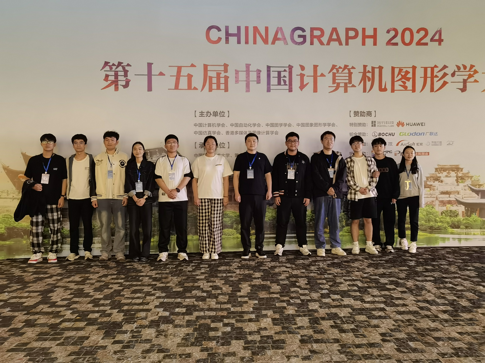
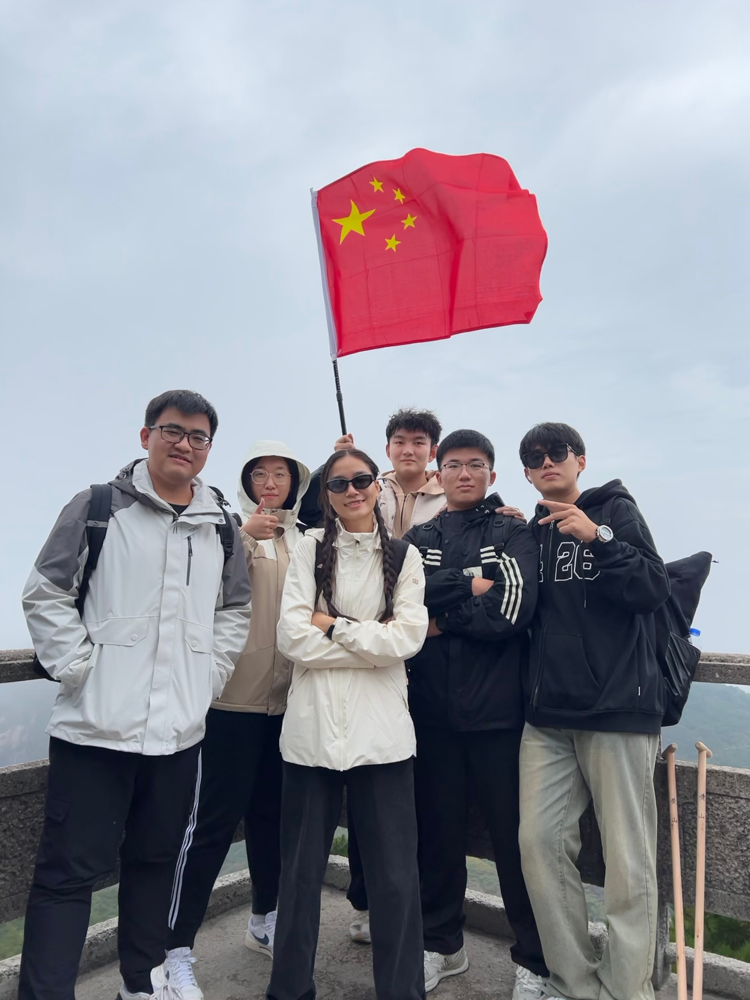
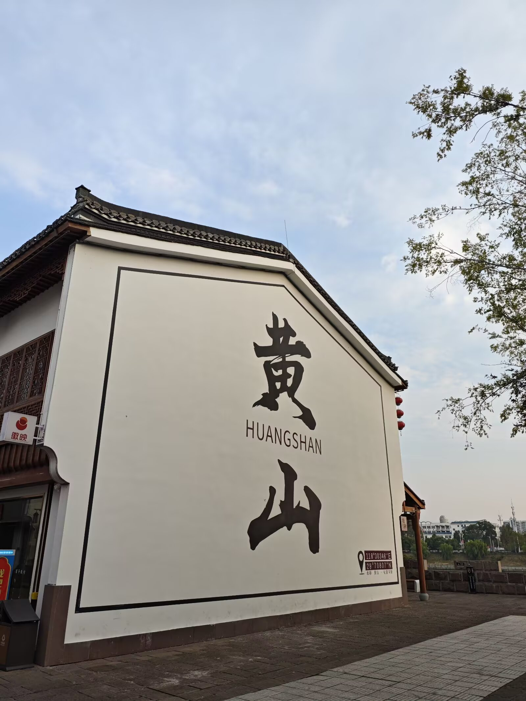
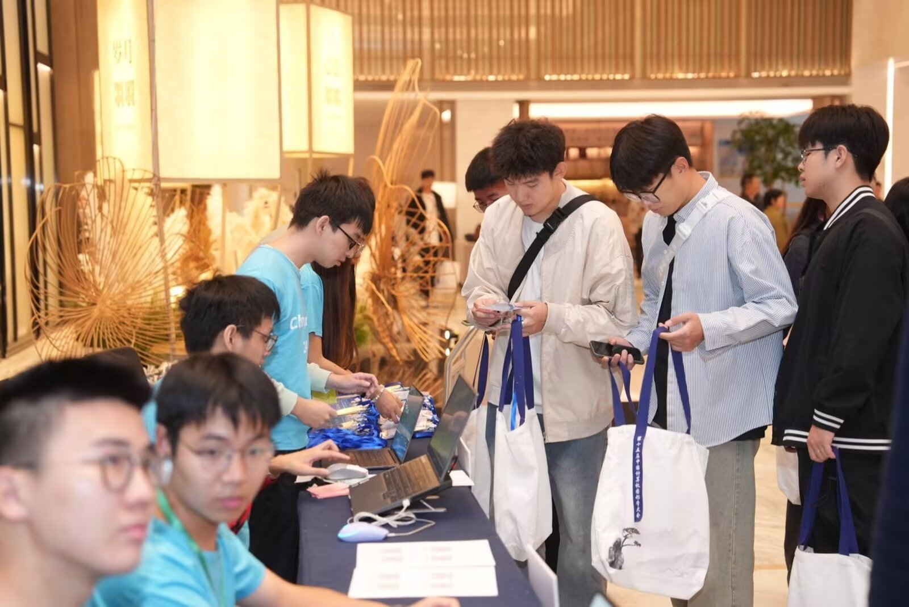

**参会记录**

安徽 · 黄山

中国计算机图形学大会（Chinagraph）是由中国计算机学会、中国自动化学会、中国图学学会、中国图象图形学学会、中国仿真学会、香港多媒体及图像计算学会于1996年发起主办，是中国计算机图形学界最高级别的学术会议，已成为华语学者计算机图形学学术交流的重要论坛。

会议每两年召开一次，迄今为止已经成功举办了十四届。第十五届中国计算机图形学大会（Chinagraph 2024）由中国科学技术大学和黄山学院承办，将于2024年10月10-13日在安徽黄山召开，CCF诚挚邀请你参加此次盛会！

