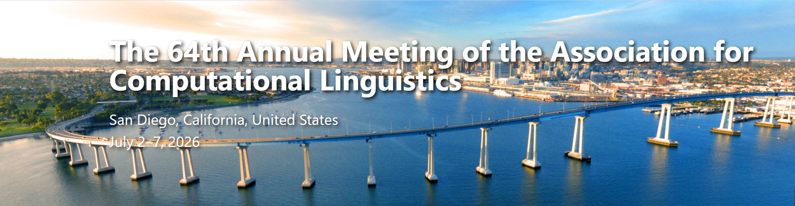

张帆教授团队近期在多模态大语言模型（LLM）与时间序列预测交叉领域取得重要进展 。相关研究成果已被计算语言学领域顶级国际学术会议 **ACL 2026** (The 64th Annual Meeting of the Association for Computational Linguistics) 正式接收。

该研究针对现有模型在融合文本语义与数值序列时存在的“语义感知失调”问题，提出了创新的异步融合方案。

### **研究成果简介**

#### **1. TimeSAF：面向时间序列预测的语义异步融合框架**
**标题：** TimeSAF: Towards LLM-Guided Semantic Asynchronous Fusion for Time Series Forecasting
**作者：** 张帆，樊世明，王华  
**核心亮点：** 该研究指出，现有的同步融合策略会导致 LLM 的高层抽象语义与时间序列的细粒度数值动态不当缠绕，产生“语义感知失调” 。团队提出的 **TimeSAF** 框架通过引入独立的**跨模态语义融合中枢**和**阶段性语义细化解码器**，显式地将单模态编码与跨模态交互解耦。实验结果显示，TimeSAF 在长程预测、少样本（Few-shot）及零样本（Zero-shot）迁移场景下均显著优于现有最先进模型。

---

**关于 ACL 会议：** ACL（Annual Meeting of the Association for Computational Linguistics）是计算语言学和自然语言处理领域最具影响力的顶级国际学术会议 。作为 **CCF-A 类**推荐会议，其录用成果代表了 NLP 及相关人工智能交叉领域的最高研究水平。

再次祝贺各位作者及团队成员！！