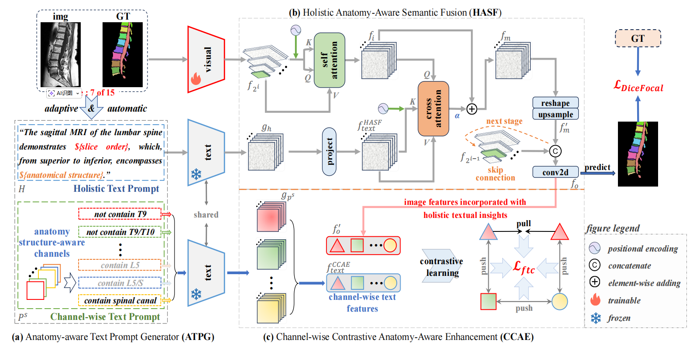

张帆教授团队在医学影像分析领域取得重要突破，相关研究成果被计算机视觉领域的国际顶尖期刊 **《International Journal of Computer Vision》(IJCV)** 正式录用。

IJCV 是计算机视觉领域公认的顶级学术期刊，以其极高的审稿标准和学术影响力著称。此次录用的论文提出了一种名为 **ATM-Net** 的创新框架 。该研究针对腰椎磁共振影像（MRI）中解剖结构复杂、相似性高等难点，首次引入了解剖学感知的文本引导多模态融合机制。

