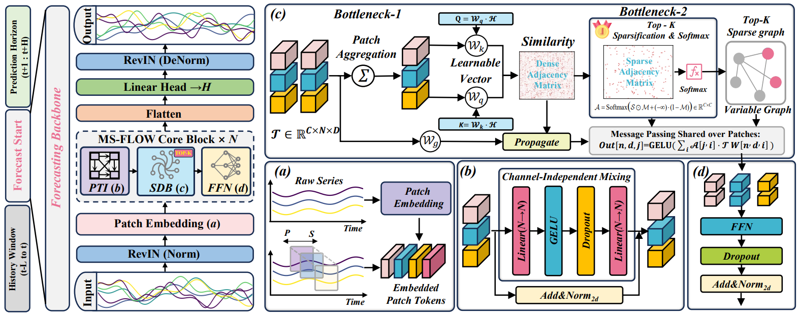
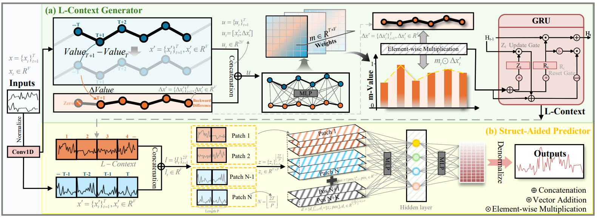
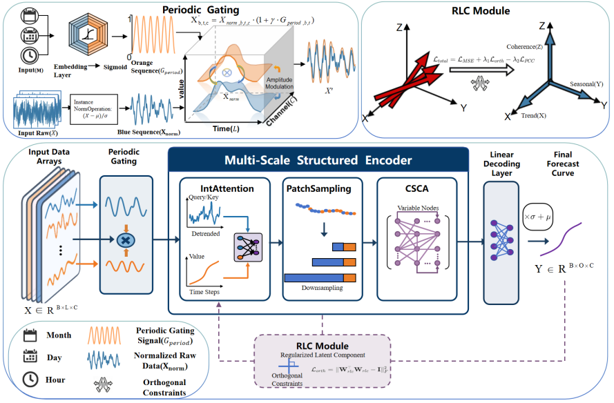

张帆教授团队近期在数据挖掘方向取得重要进展。相关三项研究成果已被机器学习领域顶级国际学术会议 **ICML 2026**（The 43rd International Conference on Machine Learning）正式接收。

三篇论文分别围绕多元时间序列预测中的**跨变量交互冗余**、**动态变化滞后响应**以及**周期感知与结构化分解**等关键问题展开研究，提出了具有创新性的建模框架，并在多个真实世界基准数据集上取得了优异表现。

### **研究成果简介**

#### **1. MS-FLOW：面向跨变量依赖建模的稀疏信息流框架**

**标题：** [What If We Let Forecasting Forget? A Sparse Bottleneck for Cross-Variable Dependencies](https://arxiv.org/pdf/2605.08289)

**作者：** 张帆，樊世明，王桦

**核心亮点：**  
该研究针对多元时间序列预测中跨变量依赖建模的核心挑战，指出现有密集交互机制虽然能够增强变量间信息交换，但也容易传播冗余信息和伪相关关系，导致噪声扩散与表示过平滑。团队提出 **MS-FLOW** 框架，将跨变量交互重新定义为一种“容量受限的信息流”过程，通过稀疏依赖瓶颈和 Top-K 选择性路由，仅保留少量关键依赖路径，从而抑制无效连接和噪声传播。实验结果表明，MS-FLOW 能够学习更可靠的多变量相关结构，在多个真实世界预测基准上取得领先性能，并推动多元预测从“更多交互”转向“更有效交互”。

---

#### **2. L-Drive：面向动态变化感知的潜在上下文驱动预测框架**

**标题：** [L-Drive: Beyond a Single Mapping—Latent Context Drives Time Series Forecasting](https://arxiv.org/pdf/2605.17730)

**作者：** 张帆，陈诗君，王桦

**核心亮点：**  
该研究发现，主流时间序列预测方法通常遵循单一的 Direct-Mapping 范式，即直接学习从历史观测到未来预测的统一映射。然而，在真实系统中，时间序列往往会受到环境变化、状态切换和突发事件影响，单一映射容易在变化点附近产生响应滞后，进而导致误差累积。为解决这一问题，团队提出 **L-Drive** 框架，引入随时间演化的 **Latent-Context** 表征，用于刻画当前动态变化模式，并通过门控机制调制增量表示，使模型能够更及时地捕捉变化信号、适应状态切换。该方法在预测精度与计算效率之间取得了良好平衡，显著提升了模型在动态变化场景下的可靠性。

---

#### **3. PESD-TSF：面向长期时间序列预测的周期感知显式结构分解框架**

**标题：** [PESD-TSF: A Period-Aware and Explicit Structured Decomposition Framework for Long-Term Time Series Forecasting](https://arxiv.org/pdf/2605.16449)

**作者：** 王桦，焦宪浩，张帆

**核心亮点：**  
该研究针对深度预测模型中周期感知衰减、趋势与噪声表征纠缠，以及通道独立建模破坏变量间动态协同等问题，提出 **PESD-TSF** 框架。该方法从物理启发的结构化分解视角出发，将时间序列动态显式分解为长期趋势、短期扰动和跨变量协同三个部分。具体而言，PESD-TSF 设计了周期感知门控机制以保持深层网络中的周期结构，引入多尺度结构化编码器以解耦趋势与高频变化，并通过跨尺度协同注意力和正则化约束恢复变量间的全局拓扑关系。实验结果表明，该框架在长期预测任务中表现出优异的预测精度、结构建模能力和可解释性。

---

**关于 ICML 会议：**  
ICML（International Conference on Machine Learning）是机器学习领域最具影响力的顶级国际学术会议之一，也是人工智能领域公认的高水平学术会议。作为 **CCF-A 类**推荐会议，ICML 汇聚了机器学习、深度学习、人工智能理论与应用等方向的前沿研究成果，其录用论文代表了相关领域的国际先进研究水平。

此次三篇论文同时被 ICML 2026 接收，充分体现了团队在时间序列预测与机器学习方法创新方面的持续积累和研究实力。

再次祝贺各位作者及团队成员！！